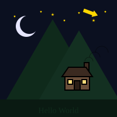
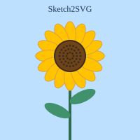
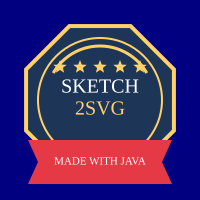

# Sketch2SVG


[](https://github.com/Furkan5E/Sketch2SVG/actions/workflows/maven.yml)

A lightweight, zero dependency Java vector graphics engine and CLI tool that converts geometric sketch scripts (`.txt`) into standards-compliant Scalable Vector Graphics (`.svg`).

[](https://github.com/Furkan5E/Sketch2SVG/releases/latest)

---

## Features

- **Zero External Runtime Dependencies:** Java implementation utilising native SVG DOM serialisation.
- **Rich Geometry Engine:** Supports `Circle` (and ellipses), `Rect`, `Square`, `Line`, `Arc`, `Star`, `RegPolygon`, `Trapezoid`, `Arrow`, free `Polygon`/`Polyline`, `Text` and `Group`.
- **Scripting:** Variables, `{expressions}`, `repeat` loops, `group` blocks, `include` files, named arguments and named colors.
- **Fluent API & Chaining:** Programmatic shape configuration with intuitive builders (`.at()`, `.fill()`, `.stroke()`, `.rotate()`, `.scale()`).
- **Fault Tolerant Parser:** Error and warning diagnostics with line (and included file) reporting.
- **Dynamic CLI:** Single file, batch (`-d`, `-r`), stdin/stdout pipelines, `--watch` and `--check` modes.
- **Automated CI/CD:** JUnit 5 test suite and tagged releases via GitHub Actions.

---

## Examples

| Night scene | Sunflower | Badge |
|:---:|:---:|:---:|
|  |  |  |
| [`sketch.txt`](src/main/resources/sketch.txt) | [`sunflower.txt`](examples/sunflower.txt) | [`badge.txt`](examples/badge.txt) |

The sunflower's 16 petals and 42 seeds come from a few lines of loops and expressions:
```text
group at=0,20
  repeat petals i
    set a {i * 360 / petals}
    circle 12 {30*cos(a)} {30*sin(a)} scale=1.6,0.7 rot=a 1 #e09f3e #ffc300
  end
  ...
end
```
Regenerate all examples with `java -jar target/Sketch2SVG.jar -d examples`.

---
## Build Instructions
```bash
mvn clean package
```
---

## CLI Usage

### Basic Conversion
```bash
java -cp target/classes com.sketch2svg.Main -i src/main/resources/sketch.txt -o output.svg
# or, using the packaged jar
java -jar target/Sketch2SVG.jar -i src/main/resources/sketch.txt -o output.svg
```

### Watch Mode
```bash
java -jar target/Sketch2SVG.jar -w -i sketch.txt -o output.svg
```
Rebuilds `output.svg` every time `sketch.txt` or any file it includes is saved. Stop with Ctrl+C.

### Pipelines
```bash
cat sketch.txt | java -jar target/Sketch2SVG.jar -i - > output.svg
```
When writing to stdout, progress messages go to stderr so the output is pure SVG.

### Batch Directory Conversion
```bash
java -cp target/classes com.sketch2svg.Main -d ./sketches -o ./dist
```
### Options
```bash
Options:
  -i, --input <file>       Path to source sketch .txt file ("-" reads stdin)
  -o, --output <file/dir>  Path for output .svg file or destination folder
                           ("-" writes stdout; the default when reading stdin)
  -d, --batch <dir>        Batch convert all .txt files inside directory
  -r, --recursive          With -d, also convert subfolders (mirrored under -o)
  -w, --watch              Re-convert whenever the input (or an included file) changes
  -f, --fit                Size the canvas to fit the drawing (overrides the script's canvas)
  -s, --size <px>          Set the image width in pixels (height follows the canvas)
  -c, --check              Only report errors and warnings; write nothing
                           (exit code 1 if any script has errors)
  -h, --help               Display this help message
  -v, --version            Display the version
```
---
## Shape	Syntax
| Shape | Command |
|---|---|
| Circle | `circle <radius> <cx> <cy> [strokeWidth] [strokeRGBA] [fillRGBA]` |
| Ellipse | `ellipse <rx> <ry> <cx> <cy> [strokeWidth] [strokeRGBA] [fillRGBA]` |
| Rectangle | `rect <w> <h> <cx> <cy> [strokeWidth] [strokeRGBA] [fillRGBA]` |
| Rounded rectangle | `roundrect <w> <h> <cornerRadius> <cx> <cy> [strokeWidth] [strokeRGBA] [fillRGBA]` |
| Square | `square <size> <cx> <cy> [strokeWidth] [strokeRGBA] [fillRGBA]` |
| Star | `star <points> <outerR> <innerR> <cx> <cy> [strokeWidth] [strokeRGBA] [fillRGBA]` |
| Polygon | `ngon <sides> <radius> <cx> <cy> [strokeWidth] [strokeRGBA] [fillRGBA]` |
| Trapezoid | `trapezoid <topW> <botW> <h> <cx> <cy> [strokeWidth] [strokeRGBA] [fillRGBA]` |
| Arrow | `arrow <length> <width> <cx> <cy> [strokeWidth] [strokeRGBA] [fillRGBA]` |
| Line | `line <x1> <y1> <x2> <y2> [strokeWidth] [strokeRGBA]` |
| Arc | `arc <radius> <angle> <length> <cx> <cy> [strokeWidth] [strokeRGBA] [fillRGBA]` |
| Text | `text <cx> <cy> <fontSize> "<content>" [strokeWidth] [strokeRGBA] [fillRGBA]` |
| Polygon (free) | `polygon <x,y> <x,y> <x,y> ... [strokeWidth] [strokeRGBA] [fillRGBA]` |
| Polyline | `polyline <x,y> <x,y> ... [strokeWidth] [strokeRGBA]` |
| Path | `path M <x,y> L <x,y> Q <c,c> <x,y> C <c,c> <c,c> <x,y> Z [strokeWidth] [strokeRGBA] [fillRGBA]` |
| Canvas | `canvas <w> <h> [cx cy]` or `canvas auto [padding]` (default: 200×200 centred on 0,0) |
| Background | `background <color>` (fills the whole canvas, always drawn first) |

```text
Colors can be:
  RRGGBBAA / RRGGBB    hex, optionally prefixed with '#' (e.g. ffdc7aff, #ffdc7a)
  #RGB / #RGBA         shorthand, '#' required (e.g. #fd7, #fd78)
  a name               black, white, gray, silver, red, maroon, orange, gold, yellow, olive,
                       lime, green, teal, cyan, blue, navy, purple, magenta, pink, brown
  none / transparent   no paint
```

### Variables & expressions
`set <name> <value>` stores a number, color, `"text"` or the result of an expression. Use a variable by writing its name as an argument (or after `key=`), and put arithmetic inside `{ }` anywhere in an argument.
```text
set gold ffd700ff
set r 5
set d {r * 2}
star 5 {r} 2 -60 {d*3} 0 none gold
polygon 0,0 {d},0 {d},{d} fill=gold
```
Expressions support `+ - * / % ^`, parentheses, `pi`, and `sin cos tan` (degrees), `sqrt abs floor ceil round min max`. Quoted text is never substituted.

### Loops
`repeat <count> [index]` … `end` runs the lines in between `count` times. The optional index variable counts from 0 and is restored afterwards. Loops can be nested.
```text
# 12 dots around a circle
repeat 12 i
  circle 3 {40*cos(i*30)} {40*sin(i*30)} 0 none gold
end
```

### Groups
`group [options]` … `end` wraps shapes in an SVG `<g>`. `at=`, `rot=` and `scale=` move, turn and resize the whole group; stroke and fill options become defaults for the shapes inside (a shape's own arguments still win). Groups can be nested and combined with loops.
```text
group at=30,-40 rot=10 stroke=2 fill=brown
  rect 42 28 0 0
  square 8 12 0 fill=gold
end
```

### Gradients
`gradient <name> linear [angle] <color> <color> …` or `gradient <name> radial <color> <color> …` defines a gradient with evenly spaced colors. Use its name anywhere a color goes: `fill=`, `stroke=`, the positional colors, `background`, and group styles. The angle is counter-clockwise (0 = left to right, 90 = bottom to top) and the gradient stretches over each shape it paints.
```text
gradient sky linear 90 #ff9e6d #0b1020
gradient sun radial #fff3b0 #ffd166 #f77f00
background sky
circle 30 0 20 0 none sun
```

### Include
`include <path>` inlines another sketch file at that point. Paths are relative to the file containing the `include`; wrap them in quotes if they contain spaces. Errors inside included files report the file name, and circular includes are rejected.
```text
include parts/house.txt
include "night sky.txt"
```

### Named arguments
Any shape also accepts named arguments, in any order, after its required parameters. They override the positional `[strokeWidth] [strokeRGBA] [fillRGBA]`.

| Argument | Meaning |
|---|---|
| `rot=<deg>` | Rotate counter-clockwise around the shape's centre |
| `stroke=<color>` / `stroke=<width>` | Stroke colour, or stroke width when given a number |
| `stroke-width=<n>` / `sw=<n>` | Stroke width |
| `fill=<color>` | Fill colour |
| `at=<x,y>` | Move the shape's centre |
| `scale=<s>` / `scale=<sx,sy>` | Multiply the shape's size |
| `dash=<a,b,…>` / `dash=none` | Dashed stroke (alternating dash and gap lengths) |
| `cap=butt\|round\|square` | Stroke line caps |
| `join=miter\|round\|bevel` | Stroke line joins |
| `arrow=end\|start\|both\|none` | Arrowheads on a `line` (drawn in its stroke colour and width) |
| `font=<family>` / `font="Family Name"` | Text font family |
| `weight=bold\|normal\|100…900`, `bold`, `italic` | Text weight and style |
| `align=left\|center\|right` | Which side of the text sits on its position (default `center`) |

```text
rect 40 20 0 0 rot=30 stroke=2 fill=ffdc7a
text 0 -90 14 "Hello World" rot=-15
```
